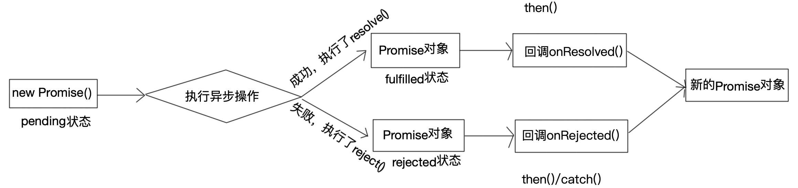

# Promise
[学习视频](https://www.bilibili.com/video/BV1jG411g7NC/?p=2&spm_id_from=pageDriver&vd_source=fce3c7fa5d7562f785a0a02cc86c0c08)
Promise是异步编程的一种解决方案
- 指定回调函数方式更灵活易懂
- 解决异步**回调地狱**问题
> 异步async与同步sync是相对的概念，单线程编程中，程序的运行是同步的，是从上往下顺序执行，而异步不按代码顺序执行，也就是从主线程发射出来一个子线程来完成异步操作。一般主线程中处理简短、快速的操作，只有上一个事件结束，才会执行下一个操作。而一些耗时较长的，例如发请求、读取文件等，可以在子线程中运行，从而不会阻塞主线程。但是，因为子线程独立于主线程，子线程任务何时结束无法确定，可以使用回调函数来处理异步任务的结果或后续操作。[参考](https://www.runoob.com/js/js-async.html)
```javascript
function ajax(url, successCB, errorCB) {
  setTimeout(function() {
    // 如果成功
    successCB()
    // 如果失败
    // errorCB()
  }, 1000)
}

ajax(url,() => {
  // 成功的处理
}, () => {
  // 失败的处理
})
```

## 回调地狱
当一个异步操作需要依赖另一个异步操作成功的结果，就会形成一种嵌套的回调，回调地狱就是多层回调函数嵌套，会导致代码可读性差，难以维护：
```javascript
ajax(url,() => {
  // 成功的处理
  ajax(url,() => {
    // 成功的处理
    ajax(url,() => {
      // 成功的处理
      ...
    }, () => {
      // 失败的处理
    })
  }, () => {
    // 失败的处理
  })
}, () => {
  // 失败的处理
})
```

## Promise使用
Promise是一个构造器函数，可以接收一个参数（executor执行器）
```javascript
var pro = new Promise((resolve, reject) => {
  // 如果成功
  resolve()
  // 如果失败
  // reject()
})
// pro.then(() => {
//   console.log('成功')
// }, () => {
//   console.log('失败')
// })
pro.then(res => {
  // 成功
}).catch(e => {
  // 失败
  console.log(e)
})
```

## Promise状态
- 异步操作未完成pending
- 异步操作成功fulfilled
- 异步操作失败rejected
```javascript
const pro = new Promise((resolve, reject) => {
  resolve()
  // reject()
}) // 此时，pro状态为pending

pro.then(res => {
  // 成功，状态fulfilled
}, () => {
  // 如果失败走这，rejected
}).catch(e => {
  // 失败，rejected
})
```
异步操作成功，pending -> fulfilled  
异步操作失败，pending -> rejected  
一旦状态发生改变，就不会再有新的状态变化  


## Promise封装ajax
```javascript
function ajax (url) {
  return new Promise((resolve, reject) => {
    var xhr = new XMLHttpRequest()
    xhr.open('GET', url, true)
    xhr.send()
    xhr.onreadystatechange = function () {
      if (xhr.readyState === 4) {
        if (xhr.status >= 200 && xhr.status < 300) {
          // 成功
          resolve(JSON.parse(xhr.responseText))
        } else {
          // 失败
          reject(xhr.responseText)
        }
      }
    }
  })
}

ajax('').then(res => {
  // 成功...
}).catch(err => {
  // 失败...
})
```

## Promise链式调用
```javascript
new Promise((resolve, reject) => {
  // ...
  resolve('data')
}).then(res => {
  console.log(res) // data
  // ...
  return Promise.resolve('res')
}).then(res => {
  // 上一个.then中返回了内容
  //  .then中返回Promise对象，则根据Promise结果走.then()还是.catch()
  //  .then中返回非Promise对象，走.then()，res为返回内容
  console.log(res) // res
  // 上一个then中没有返回，则res为undefined
}).then(res => {
  // 上一个.then中没有返回，则res默认undefined
  console.log(res) // undefined
  return Promise.reject('error')
}).catch(err => {
  // 上面任意一步返回Promise.reject()，则会走到这
  console.log(err) // error
})
```

## 手写Promise
```js
function MyPromise(executor) {
  var self = this;
  self.state = 'pending';
  self.value = undefined;
  self.onResolvedCallbacks = [];
  self.onRejectedCallbacks = [];

  function resolve(value) {
    if (self.state === 'pending') {
      self.state = 'fulfilled';
      self.value = value;
      self.onResolvedCallbacks.forEach(function(callback) {
        callback(self.value);
      });
    }
  }

  function reject(reason) {
    if (self.state === 'pending') {
      self.state = 'rejected';
      self.value = reason;
      self.onRejectedCallbacks.forEach(function(callback) {
        callback(self.value);
      });
    }
  }

  try {
    executor(resolve, reject);
  } catch (error) {
    reject(error);
  }
}

MyPromise.prototype.then = function(onFulfilled, onRejected) {
  var self = this;
  var promise2;

  onFulfilled = typeof onFulfilled === 'function' ? onFulfilled : function(value) { return value; };
  onRejected = typeof onRejected === 'function' ? onRejected : function(reason) { throw reason; };

  if (self.state === 'fulfilled') {
    promise2 = new MyPromise(function(resolve, reject) {
      setTimeout(function() {
        try {
          var x = onFulfilled(self.value);
          resolvePromise(promise2, x, resolve, reject);
        } catch (error) {
          reject(error);
        }
      }, 0);
    });
  }

  if (self.state === 'rejected') {
    promise2 = new MyPromise(function(resolve, reject) {
      setTimeout(function() {
        try {
          var x = onRejected(self.value);
          resolvePromise(promise2, x, resolve, reject);
        } catch (error) {
          reject(error);
        }
      }, 0);
    });
  }

  if (self.state === 'pending') {
    promise2 = new MyPromise(function(resolve, reject) {
      self.onResolvedCallbacks.push(function() {
        setTimeout(function() {
          try {
            var x = onFulfilled(self.value);
            resolvePromise(promise2, x, resolve, reject);
          } catch (error) {
            reject(error);
          }
        }, 0);
      });

      self.onRejectedCallbacks.push(function() {
        setTimeout(function() {
          try {
            var x = onRejected(self.value);
            resolvePromise(promise2, x, resolve, reject);
          } catch (error) {
            reject(error);
          }
        }, 0);
      });
    });
  }

  return promise2;
};

function resolvePromise(promise, x, resolve, reject) {
  if (promise === x) {
    reject(new TypeError('循环引用'));
  }

  if (x && (typeof x === 'object' || typeof x === 'function')) {
    var called = false;

    try {
      var then = x.then;

      if (typeof then === 'function') {
        then.call(
          x,
          function(y) {
            if (called) return;
            called = true;
            resolvePromise(promise, y, resolve, reject);
          },
          function(reason) {
            if (called) return;
            called = true;
            reject(reason);
          }
        );
      } else {
        resolve(x);
      }
    } catch (error) {
      if (called) return;
      called = true;
      reject(error);
    }
  } else {
    resolve(x);
  }
}
```
