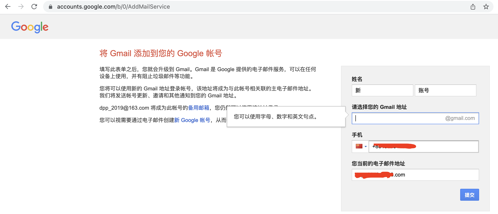
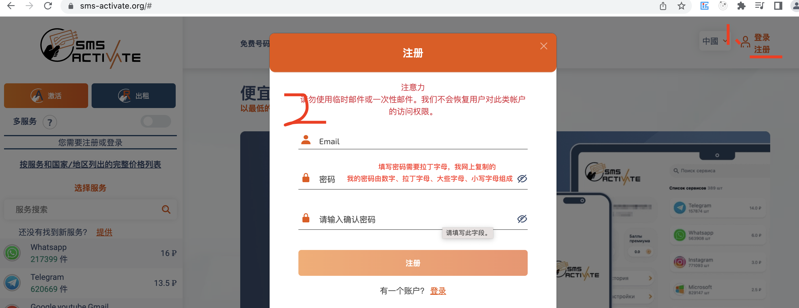
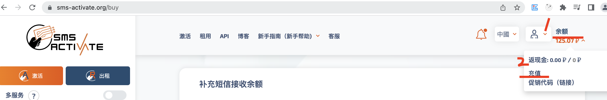
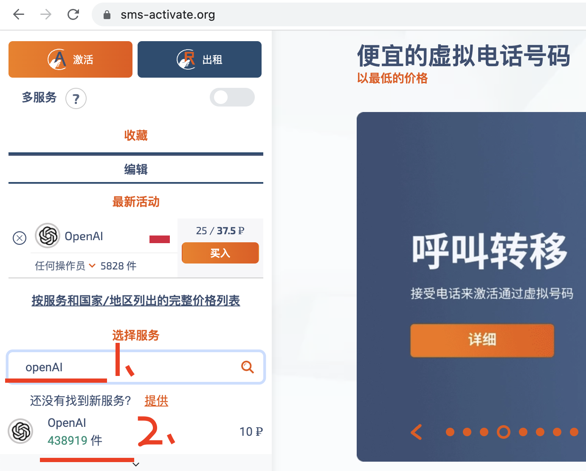
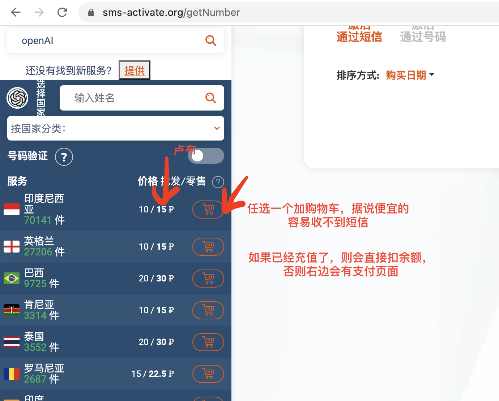
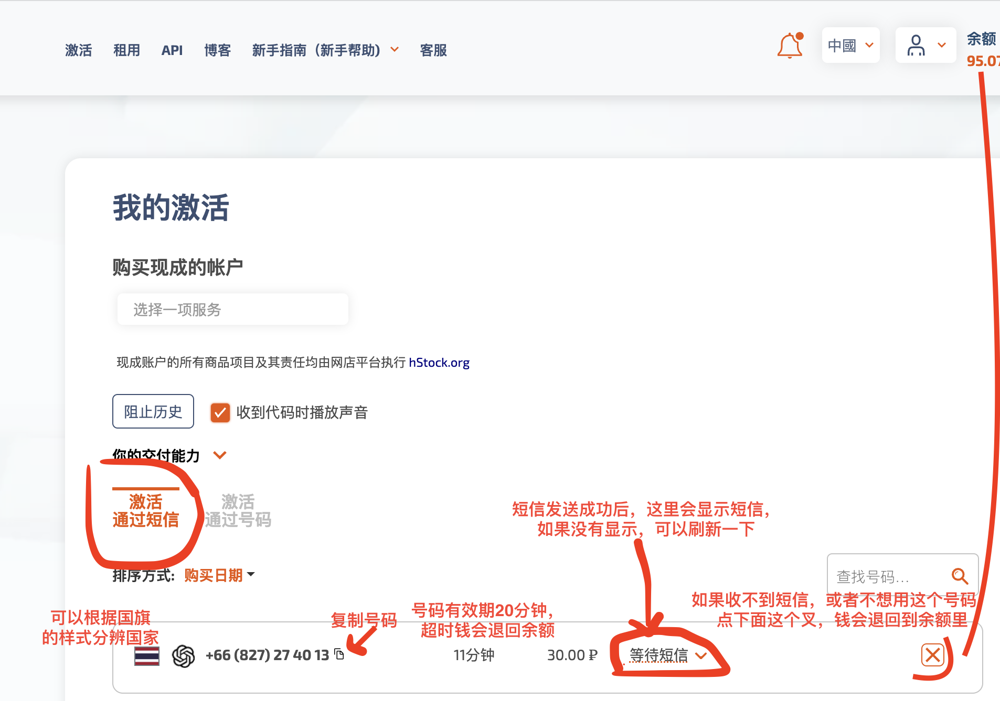
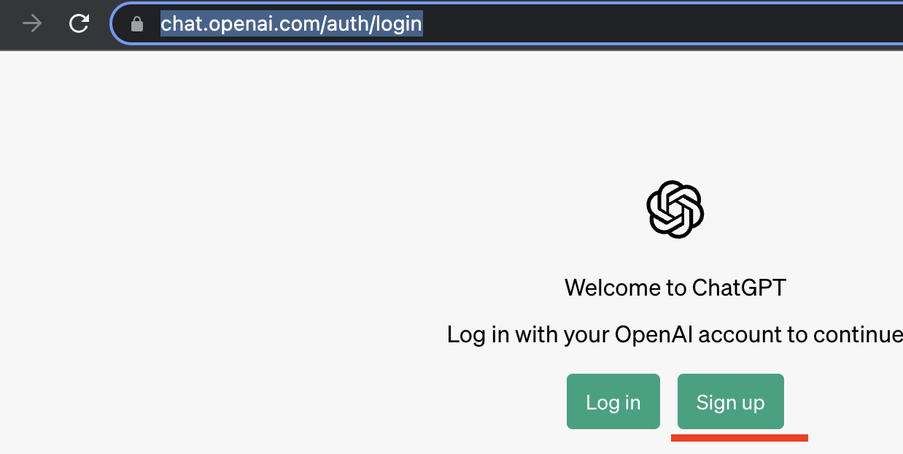
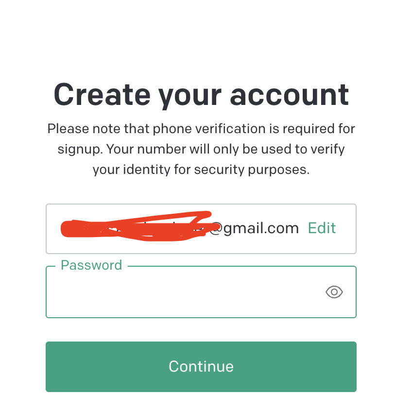
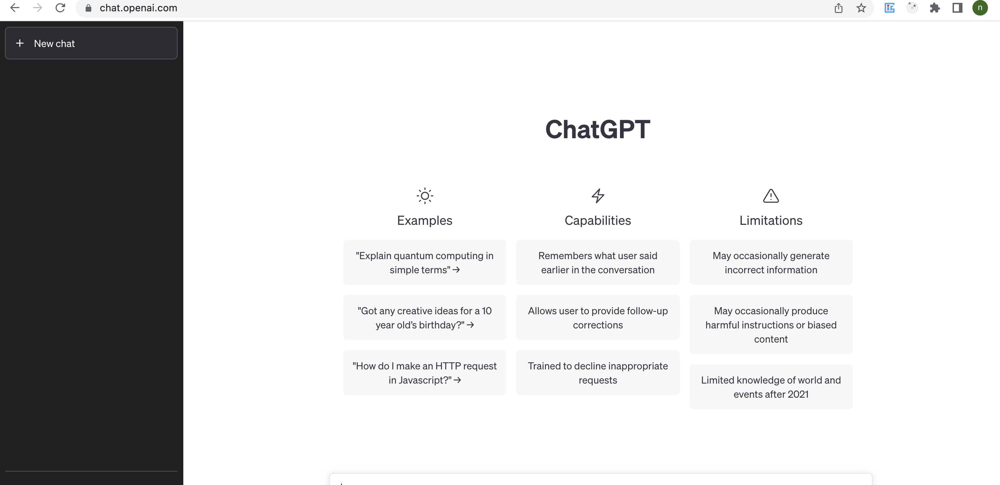

# 记录注册chartGPT(2023-05-24)
1. 准备一个邮箱（网易试过不行），我用的是gmail；
2. 准备一个外国手机号接收短信；
3. 进入chatGPT注册页面操作（翻墙）。

## 注册一个google邮箱
因为试过网易邮箱不行，然后干脆注册一个google邮箱
1. 注册一个谷歌账号
2. 添加gmail：[https://accounts.google.com/b/0/AddMailService](https://accounts.google.com/b/0/AddMailService)

另一个地址好像可以直接注册：
[https://accounts.google.com/signup/v2/webcreateaccount?flowName=GlifWebSignIn&flowEntry=SignUp](https://accounts.google.com/signup/v2/webcreateaccount?flowName=GlifWebSignIn&flowEntry=SignUp)

## 准备一个国外的手机号接收短信
这边我使用一个短信接码平台：[https://sms-activate.org/](https://sms-activate.org/) 但是是付费的。

1. 注册接码平台

2. 充值

	然后可以充值，往下翻可以看到支付宝，然后最低充值2$，也可以在选择手机号后充值：
	

3. 购买手机号

	在页面左边选择openAI
	

	选择一个国家的手机号加购物车，我选的是一个白+红颜色国旗的。如果余额够，会直接扣余额，否则会显示支付页面。
	

	成功购买号码后，可以查看短信，如果没有看到，可以刷新一下页面。这里的手机号可以复制，然后填入到chatGPT注册时所需的手机号，注意这里复制的手机号带了区号，填写时要删掉。
	

4. 在chatGPT使用该手机号成功发送短信之后，复制接收到的验证码

## chatGPT注册
注册失败可能的原因：1.邮箱不支持，建议换个邮箱；2. IP被禁了，建议换一个，我用的台湾的代理

1. 进官网注册：[https://chat.openai.com/auth/login](https://chat.openai.com/auth/login)

	

2. 然后填写邮箱、密码

3. 后面需要填写手机号（忘截图了）

	注意国家要选择你购买的手机号的国家（可以看国旗），然后复制接码平台的手机号，复制的手机号带了区号，要删掉。
	如果成功，则会显示要输入6位验证码
4. 去接码平台复制接收到的验证码填入，然后就成功了，会跳转到chatgpt页面：

