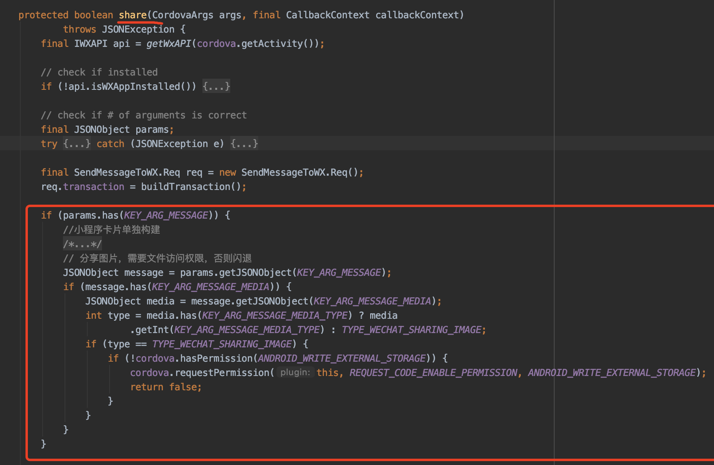

# 微信分享安卓手机闪退
## 描述
使用cordova-plugin-wechat插件，对于安卓手机，点击分享到微信，弹出“获取文件访问权限”，过一会闪退

## 原因
报“文件访问权限被拒”的错，应该是弹出访问权限的同时，微信分享未停止，然后就因为没（来得及给）获取到文件访问权限闪退。

## 解决
找到 项目/plugins/cordova-plugin-wechat/src/android/wechat.java文件中的share方法，添加一个判断：  
如果是图片分享，如果没有文件访问权限，就弹出访问获取权限弹框，同时return false（终止分享）  
理论上最好等 访问获取权限弹框 的结果，也就是用户同意的话继续分享，不同意则终止分享（用回调或等待的方式），但是我不会java，不知道怎么写，只好直接return了
```java
JSONObject message = params.getJSONObject(KEY_ARG_MESSAGE);
if (message.has(KEY_ARG_MESSAGE_MEDIA)) {
    JSONObject media = message.getJSONObject(KEY_ARG_MESSAGE_MEDIA);
    int type = media.has(KEY_ARG_MESSAGE_MEDIA_TYPE) ? media
            .getInt(KEY_ARG_MESSAGE_MEDIA_TYPE) : TYPE_WECHAT_SHARING_IMAGE;
    // 分享图片，需要文件访问权限，否则闪退
    if (type == TYPE_WECHAT_SHARING_IMAGE) {
        if (!cordova.hasPermission(ANDROID_WRITE_EXTERNAL_STORAGE)) {
            cordova.requestPermission(this, REQUEST_CODE_ENABLE_PERMISSION, ANDROID_WRITE_EXTERNAL_STORAGE);
            return false;
        }
    }
}
```

