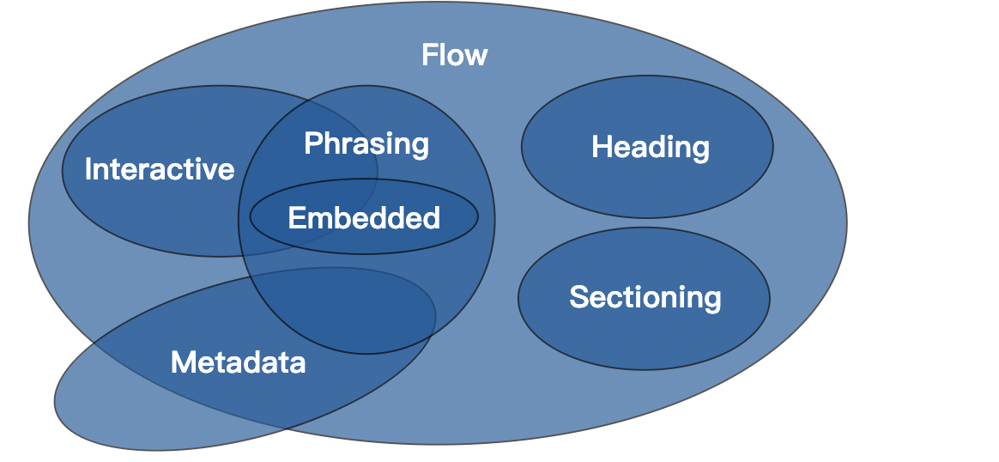

# p嵌套div
https://www.w3.org/TR/2011/WD-html5-20110525/content-models.html
> Each element defined in this specification has a content model: a description of the element's expected contents. An HTML element must have contents that match the requirements described in the element's content model

根据html标准，每个html元素都有一个content model（该元素应该接收什么样的内容）

> Each element in HTML falls into zero or more categories that group elements with similar characteristics together. The following broad categories are used in this specification

每个元素都属于0或多种类别（content categories）



p的content model是phrasing content，div属于flow content，和p的content model不匹配，所以p里面不能嵌套div
```javascript
<p>
  <div></div>
</p>
```
在浏览器中渲染的结果：
```
<p></p>
<div></div>
<p></p>
````
解析：
```
<p></p> // 在渲染p时，如果碰到div，p会自动闭合
<div></div>
// 再往下解析，发现还有一个p的闭合标签，会自动补齐
<p></p>
````
