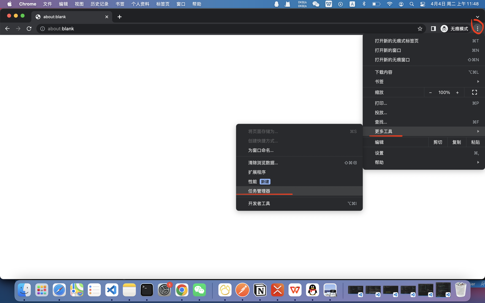
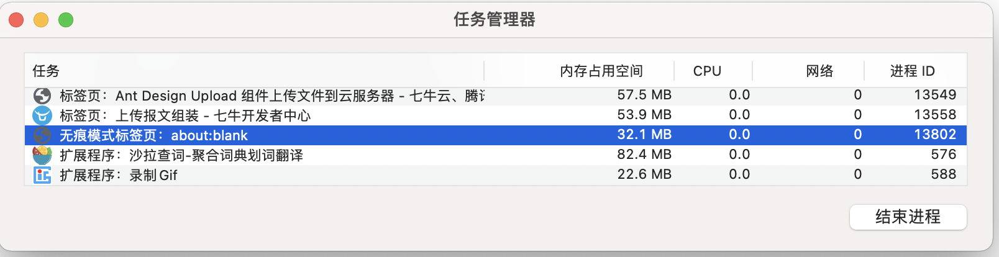

# 内存泄漏问题排查修复
参考：https://www.cnblogs.com/liuyongqi/p/14950049.html  
https://www.cnblogs.com/plBlog/p/11429939.html

## 检测内存泄漏的方法
https://v2.cn.vuejs.org/v2/cookbook/avoiding-memory-leaks.html  
打开浏览器任务管理器，查看内存占用情况:



如果同一个页面做了某些操作后，或者反复切换页面，等页面稳定后，内存明显增加，说明有一些内存没有被释放掉

## 解决/优化措施
1. 创建的实例需要及时释放掉
  这种一般会产生闭包，导致DOM对象和脚本中的对象双向引用，然后DOM关闭页面会被销毁，js对象没有调用销毁方法释放掉
  - echarts实例手动销毁
  ```javascript
  const chart = new echarts.init(el)
  chart.setOptions(options)

  // 关闭页面等情况下可以将实例销毁掉
  chart?.dispose()
  ```
  - amap/bmap地图实例销毁
  ```javascript
  const map = new AMap.Map(container, options)

  // 销毁
  map?.destroy()
  ```
  - 销毁视频实例
  视频不播放的时候记得不要再拉流了，一般视频播放插件会有销毁实例的方法
  ...
2. 页面销毁时移除removeEventListener
  ```javascript
  el.addEventListener(event, handle)

  // 移除监听
  el.removeEventListener(event, handle)
  ```
3. EventBus事件解绑
  ```javascript
  eventBus.off(event, handle)
  this.$off(event, handle) // 父子组件事件监听后到解绑
  ```
4. 清理定时器
  ```javascript
  clearInterval(timer)
  clearTimeout(timer)
  ```
5. 删除开发时留下的不必要的console.log
6. 不要一次渲染过多的node节点
  容易卡，可能卡崩溃了  
  可以使用分页或者懒加载、虚拟滚动等方式
7. 减少页面中不必要的引入
  ```javascript
  import { a, b, c, ... } from 'xxx'
  // 页面中只用到a，结果引入一堆不必要的东西，影响性能
  const val = a
  ```
8. 减少this上的状态
  this对象一直存在不会被回收
9. 可以给一些操作，如接口调用，增加catch，方式操作失败影响后续内容执行（非内存泄漏）


